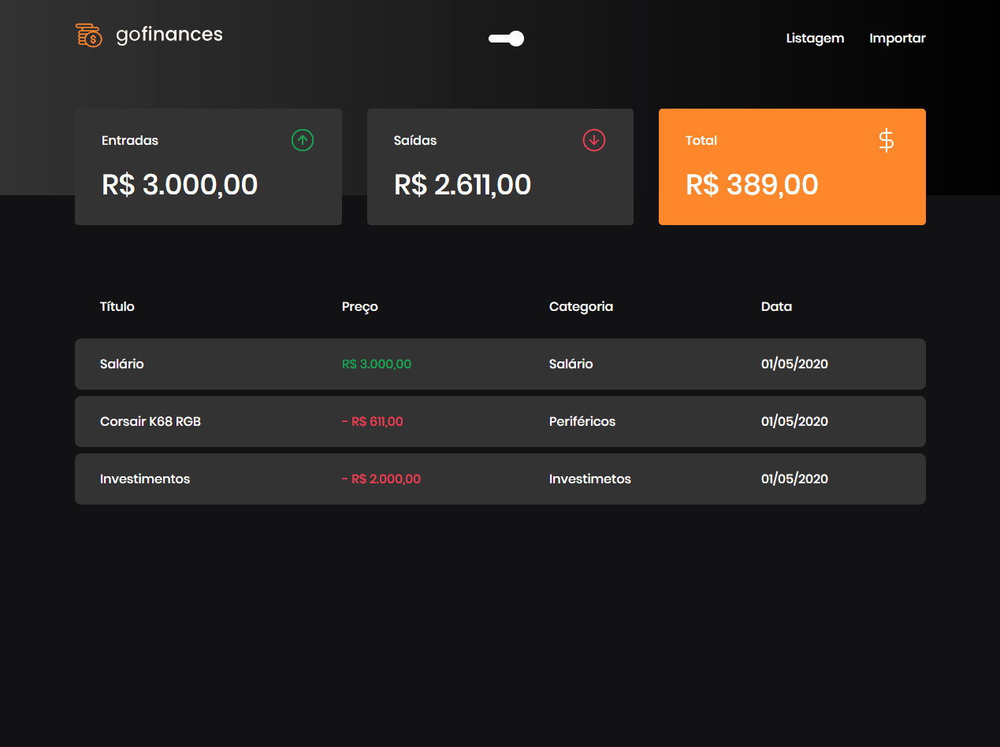
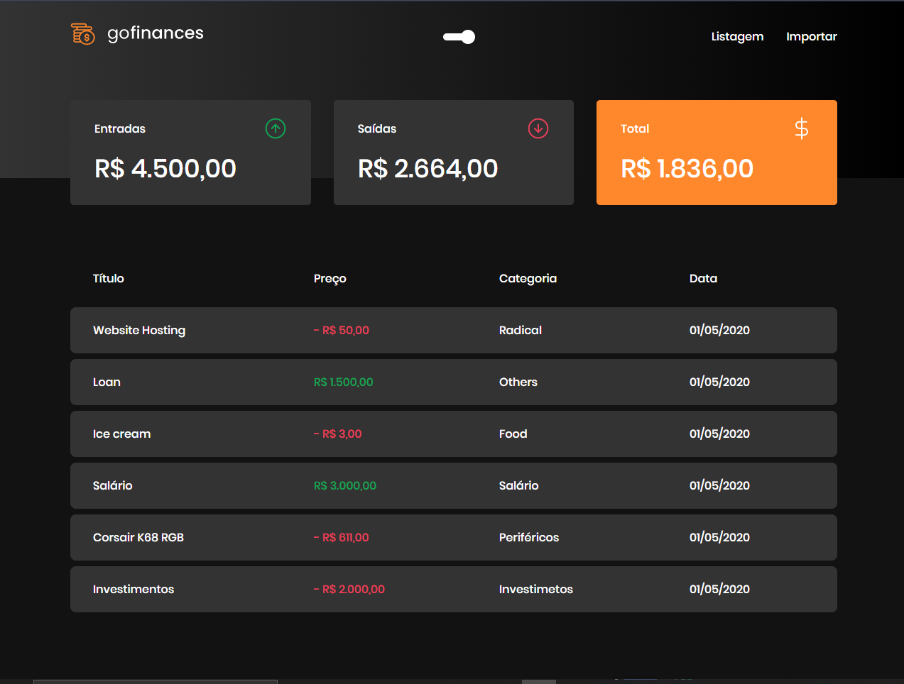
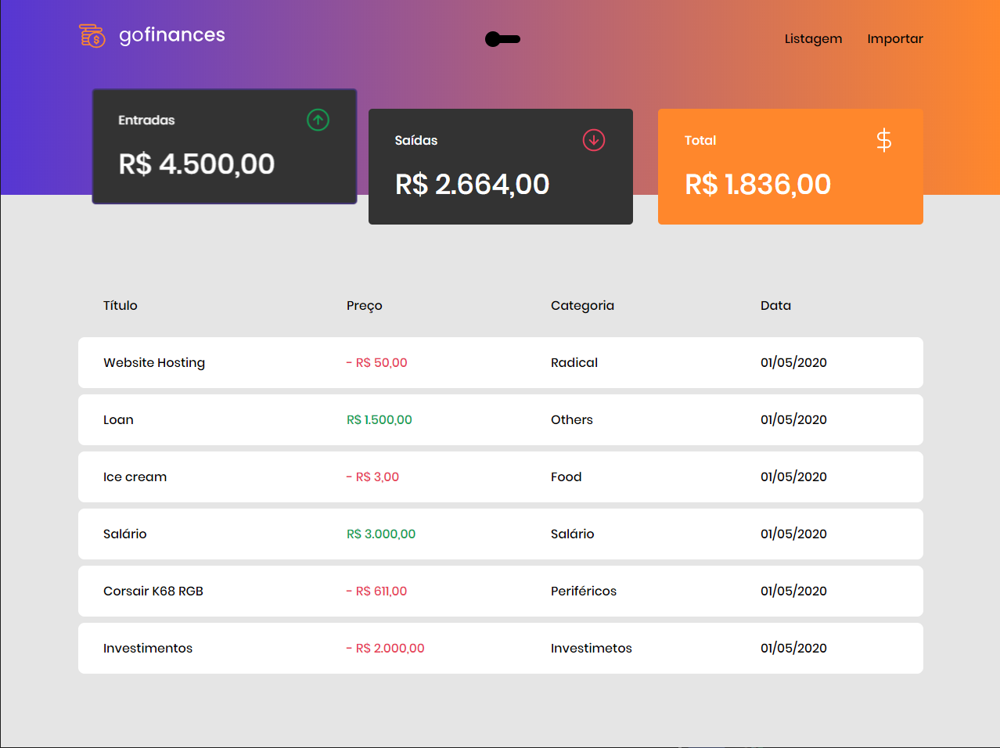
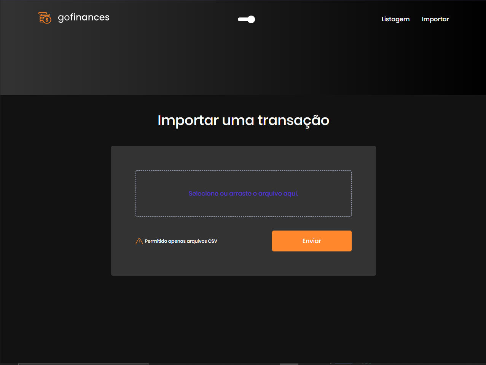
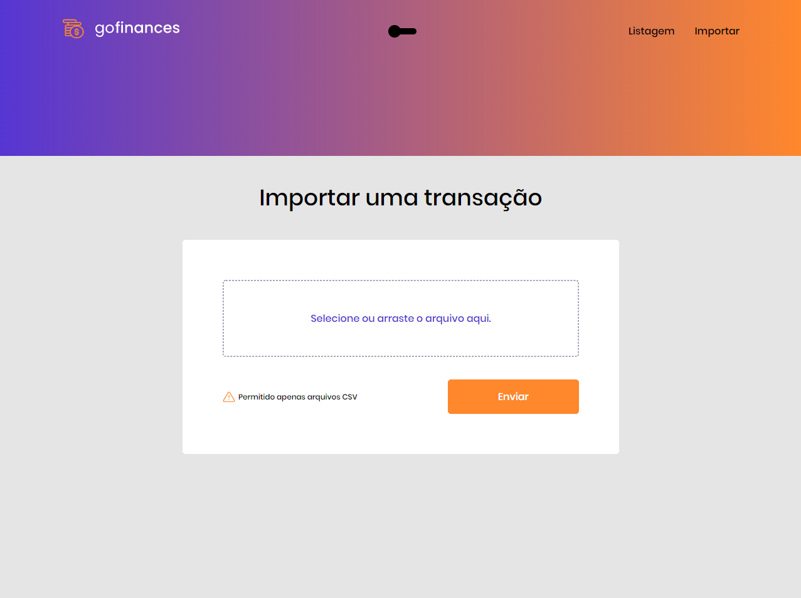

<h1 align="center">
   GoFinancesWeb
</h1>

 

## :camera: Demonstração

## :rocket: Tecnologias

Esse projeto foi desenvolvido com as seguintes tecnologias:

✔️Typescript

✔️React

✔️React Hooks

✔️Styled-components

✔️Polished

✔️Docker

✔️PostgreSQL

✔️Node

✔️Axios

## 💻 Projeto

GoFinances uma aplicação financeira consumindo a API do back-end, gerenciando transações.

## ⚙ Configuração

1- Para instalar as dependências:
> yarn

2- Para iniciar a aplicação:
> yarn start

---

